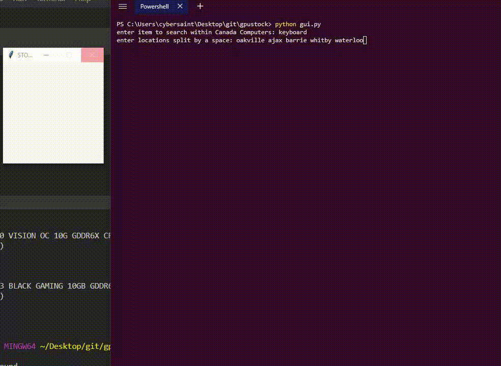

# Stock Scraper
scrapes product stock values from canadacomputers.com based on store location

install ) 
download zip of repo., unzip into a folder. 
having python and pip installed, navigate to the folder containing files, do `pip install -r requirements.txt` to install necessary dependencies. 
(if not: https://www.python.org/downloads/, https://pip.pypa.io/en/stable/installing/) 
run `python gui.py` 
 
operation ) 
1) enter in search term to scrape canadacomputers for 
2) enter the store locations (check @ canadacomputer's site to see what locations are actually available) 
3) wait for window to update and display stock information 
4) press numbered button to re-scrape and update information (number signifies the number of updates done) 
 
information is displayed in both the console and window 

editing ) 
to make the operation of the program automated (updated without intervention, after certain time intervals): open `gui.py` in any text editors (n++, py idle, vscode) and find `line 179: #root.after(ms, updatestock)`, and uncomment it (remove '#'). specify the time interval in milliseconds to refresh data (recommended > 30000ms (30s)) 
